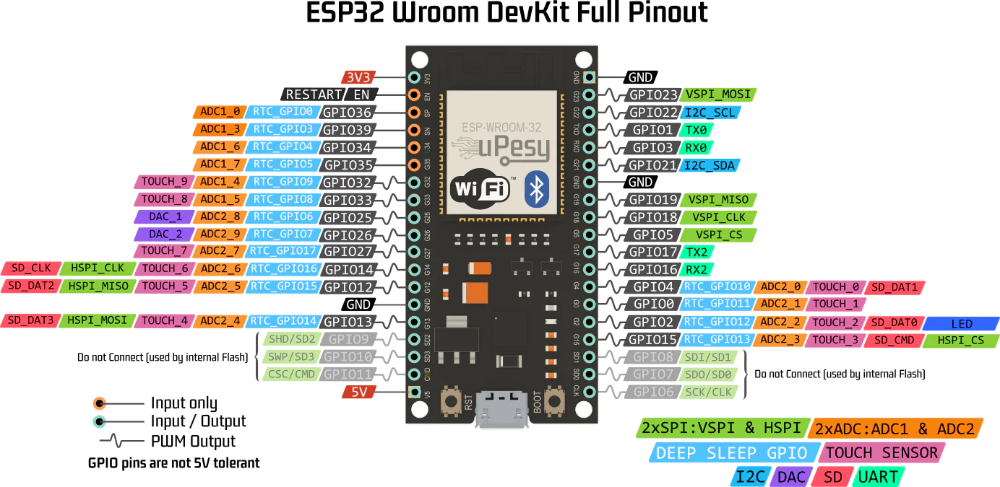

# ASTR-201-project
###### Final project by Cole Crouter & Braden Breit

## Summary

This project uses an Arduino to create a digital sundial that can be read via computer or smartphone. When the user goes to the website, they are prompted for their location, and to connect and align the sundial. The website then displays relevant information to the Sun's current position in the sky.

This project consists of two parts; the Arduino code and the website. The Arduino code is located in the `arduino` folder, and the website is located in the root directory.

> Note: Only Google Chrome and Microsoft Edge are supported for the website. The website uses the Web Bluetooth API, which is only supported in these browsers.

## How It Works

#### Calculation

In order to calculate the time given the position of the Sun, we need the observer's location and the date. We can query both of these from a user's browser. While this might seem redundant since the user is obviously connected to the internet, it isn't *entirely* impractical.

There is a lot of math, so check it out in [this file](/src/lib/SunMath.ts). The bulk of it is focused around finding the Sun's hour angle, which we have derived in terms of the Sun's position, rather than time. This allows us to calculate the time given the Sun's position, rather than the other way around.

#### Technology

Upon first load, the website is cached into the device's browser, allowing for offline usage. If a user didn't know the date, they input a rough estimate in their device's settings. As for location, if location is unavailable, the user is prompted to enter their location manually.

That being said, this project could theoretically be used in a situation where the user is offline and doesn't know the date or time.

## Hardware

The hardware used for this project is as follows:

- BLE enabled Arduino (Arduino Nano 33 BLE, ESP32, etc.)
- 26 GL5516 photoresistors (50mm)
- 13 resistors
- QMC5883L compass sensor
- 16-bit multiplexer


We essentially wire up the photoresistors like this, then into a multiplexer. The multiplexer is then wired to the Arduino. The compass sensor is wired directly to the Arduino.

Make sure to hook up the compass sensors pins to the appropriate pins on the Arduino. For the ESP32, that's the 21 and 22.



## Software

### Arduino

> This sketch takes advantage of the ArduinoBLE library, which is not included in the Arduino IDE by default. To install it, open the Arduino IDE, go to `Tools > Manage Libraries...`, search for `ArduinoBLE` and `QMC5883LCompass`, and install the latest version.

Download the sketch from the `arduino` folder and upload it to your Arduino.

### Website

##### The latest version of the website is hosted at https://mexican-man.github.io/astr-201-project/.

The website is build with SvelteKit, but compiles to a static site. To run the website locally, clone this repository and run the following commands:

```bash
npm install
npm run preview
```

> Note: Chrome disables the Web Bluetooth API on insecure origins. To connect to the Arduino, you must either be on `localhost` or use HTTPS (or enable the `#enable-experimental-web-platform-features` flag).

## Images

